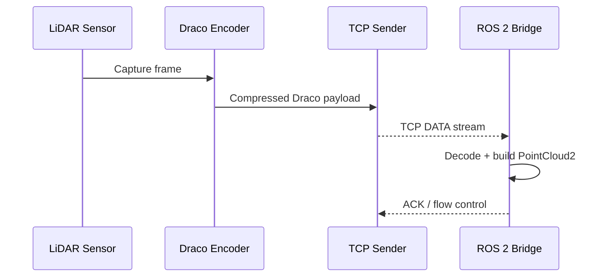

# Draco TCP/IP Roundtrip Workspace

Draco TCP/IP Roundtrip 워크스페이스는 LiDAR 포인트클라우드를 Draco로 압축해 TCP 위에서 왕복 전송하고, 복원 품질과 지연을 검증하는 ROS 2 기반 환경입니다. `draco_roundtrip`, `draco_tools`, `slam_stream_bridge` 패키지가 공용 유틸리티와 프로토콜을 공유해 실시간 스트리밍과 배치 분석을 동일한 파이프라인으로 다룰 수 있습니다.

## 문서 네비게이터

전체 문서 모음은 [`docs/reference/Documentation_Index.md`](docs/reference/Documentation_Index.md)에서 범주별로 바로가기를 제공합니다. 주요 문서를 빠르게 살펴보려면 아래 표를 참고하세요.

| 카테고리 | 문서 | 핵심 내용 |
| --- | --- | --- |
| 가이드 | [사용자 가이드](docs/guides/User_Guide.md) | 환경 설정, 스트리밍/SLAM bringup, 로그 수집 절차를 순서대로 안내합니다. |
| 아키텍처 | [아키텍처 설계 및 지연 시간 계획](docs/architecture/Architectural_Design_and_Plan.md) | 비동기 파이프라인, 제어 플레인, 지연 최적화 로드맵을 설명합니다. |
| 추적성 | [추적성 매트릭스](docs/architecture/Traceability_Matrix.md) | 요구사항, 구현, 테스트 간 연결을 관리합니다. |
| 참조 | [구성 참조](docs/reference/Configuration_Reference.md) | 레이아웃 프로파일, QoS 검색 규칙, 주요 CLI 플래그를 정의합니다. |
|  | [프로토콜 및 스키마 참조](docs/reference/Protocol_and_Schema_Reference.md) | 제어 메시지, 상태 기계, 텔레메트리 스키마를 명세합니다. |
| 개발 | [개발 프로세스](docs/development/Development_Process.md) | 체크리스트 기반 워크플로와 완료 정의를 제공합니다. |
|  | [성능 시험 계획](docs/development/Performance_Test_Plan.md) | rosbag 회귀 벤치마크 구성과 실행 절차를 명시합니다. |
|  | [런타임 안정성 메모](docs/development/Runtime_Stability_Notes.md) | 실패 모드와 완화 전략을 정리합니다. |
| 운영 품질 | [성능 시험 계획(요약)](docs/quality/Performance_Test_Plan.md) | 자동화된 지연/하트비트 목표와 검증 항목을 추적합니다. |
|  | [실험 결과 템플릿](docs/quality/results_template.md) | 실행 보고서에 필요한 메타데이터와 목표를 템플릿으로 제공합니다. |
| 보고서 | [프로젝트 진행 보고서](docs/reports/Project_Progress_Report.md) | 단·중기 계획과 상태 표를 요약합니다. |
|  | [리팩터 및 감사 로그](docs/reports/Refactor_and_Audit_Log.md) | 감사 결과, 리팩터 타임라인, 후속 작업을 기록합니다. |

## 빠른 시작

### 필수 준비
1. **ROS 2 Humble**을 설치하고 빌드 전 환경을 소스합니다.
2. 저장소를 클론한 뒤 `rosdep install`과 `colcon build`로 워크스페이스를 빌드합니다.
3. 저장소 루트에서 Python 패키지를 editable 모드로 설치해 ROS 2 노드와 CLI가 동일한 유틸리티를 사용하도록 합니다.
4. `DRACO_HOME` 또는 PATH에 Draco 인코더/디코더 실행 파일을 등록합니다.

### 워크스페이스 빌드
```bash
source /opt/ros/<distro>/setup.bash
cd /workspace/draco_tcpip/ros2_ws
colcon build --symlink-install
source install/setup.bash
```

### 스트리밍 예시
```bash
# 서버 (텔레메트리와 결정적 EOF 핸드셰이크 포함)
ros2 run draco_roundtrip stream_server --port 5000

# 클라이언트 (rosbag → Draco → TCP 전송)
ros2 run draco_roundtrip stream_client \
    --bag /path/to/bag \
    --topic /sensing/lidar/top/pointcloud \
    --prefix demo_run \
    --layout-profile client.profile.yaml
```
`stream_server`와 `stream_client`는 제한 큐, 바이너리 프로토콜, 텔레메트리 스키마를 공유하며, bringup 런치로 SLAM까지 통합 실행할 수 있습니다.

### 엔드투엔드 데이터 흐름 요약

<!-- AUTODOC:E2E_SEQUENCE_SIMPLE -->
<!-- AUTODOC:E2E_SEQUENCE_SIMPLE:BEGIN -->

<!-- AUTODOC:E2E_SEQUENCE_SIMPLE:END -->

### SLAM Bringup 및 네트워크 에뮬레이션
통합 런치를 사용해 서버, 클라이언트, SLAM, 네트워크 프로파일을 동시에 구동할 수 있습니다.
```bash
ros2 launch slam_stream_bridge bringup.launch.py \
    bag:=/path/to/bag \
    topic:=/sensing/lidar/top/pointcloud \
    layout_profile:=client.profile.yaml \
    slam:=hdl
```
`stream_netem` CLI로 `configs/netem.profiles.yaml`에 정의된 네트워크 조건을 적용하고, 실험 후 반드시 초기화합니다.

## 배치 파이프라인과 품질 분석

`draco_tools` 패키지는 bag → PLY → Draco → 품질 분석을 일괄 수행하는 오프라인 파이프라인과 품질 템플릿을 제공합니다.

```bash
ros2 run draco_tools bag_to_ply --bag /path/to/bag --out data/ply_raw
ros2 run draco_tools encode_ply_to_draco --in data/ply_raw --out data/draco_out
ros2 run draco_tools offline_pipeline \
    --bag /path/to/bag \
    --topic /sensing/lidar/top/pointcloud \
    --prefix regression_baseline \
    --layout-profile client.profile.yaml
```

품질 보고서는 `docs/quality/results_template.md` 양식에 맞춰 작성하고, 텔레메트리는 `Protocol_and_Schema_Reference.md`의 스키마를 준수해야 합니다.

## 개발 및 품질 보증

- **개발 워크플로**: Pyright/ruff/pytest 조합, 체크리스트, 결과 문서화 절차는 [개발 프로세스](docs/development/Development_Process.md)에 요약되어 있습니다.
- **성능 게이트**: `pytest tests/perf/test_latency_gate.py`로 p95 지연 250 ms 목표를 검증하며, 설정과 임계값은 [성능 시험 계획](docs/development/Performance_Test_Plan.md)에 정의되어 있습니다.
- **런타임 안정성**: 스트리밍 클라이언트/서버의 상태 전이, 공유 메모리 정리, 종료 로그 정책은 [런타임 안정성 메모](docs/development/Runtime_Stability_Notes.md)에 정리되어 있습니다.
- **운영 지표**: `docs/quality/Performance_Test_Plan.md`는 자동화된 목표를, `docs/runtime/Runtime_Stability_Notes.md`는 장시간 세션 모니터링 결과를 제공합니다.

## 보고 및 추적

- [프로젝트 진행 보고서](docs/reports/Project_Progress_Report.md)에서 단·중기 계획과 상태 표를 확인합니다.
- [리팩터 및 감사 로그](docs/reports/Refactor_and_Audit_Log.md)는 감사 결과, 리팩터 타임라인, 후속 작업을 추적합니다.
- 요구사항 매핑과 테스트 연결은 [추적성 매트릭스](docs/architecture/Traceability_Matrix.md)에 기록되어 있어 변경 영향 범위를 빠르게 파악할 수 있습니다.

## 리포지터리 구조

```
.
├── configs/                # QoS, 네트워크 에뮬레이션, 레이아웃 프로파일
├── docs/                   # 가이드, 아키텍처, 참조, 보고서 모음
├── ros2_ws/
│   └── src/
│       ├── draco_roundtrip/       # 스트리밍 노드, CLI, 공용 유틸리티
│       ├── draco_tools/           # 배치 파이프라인과 분석 도구
│       └── slam_stream_bridge/    # SLAM 통합 런치 파일
├── scripts/                # CI, 문서 자동화, 실험 스크립트
└── tests/                  # 단위/성능/회귀 테스트 스위트
```

각 패키지와 콘솔 엔트리포인트에 대한 자세한 개요는 [코드베이스 개요](docs/reference/codebase_overview.md)를 참고하세요.
