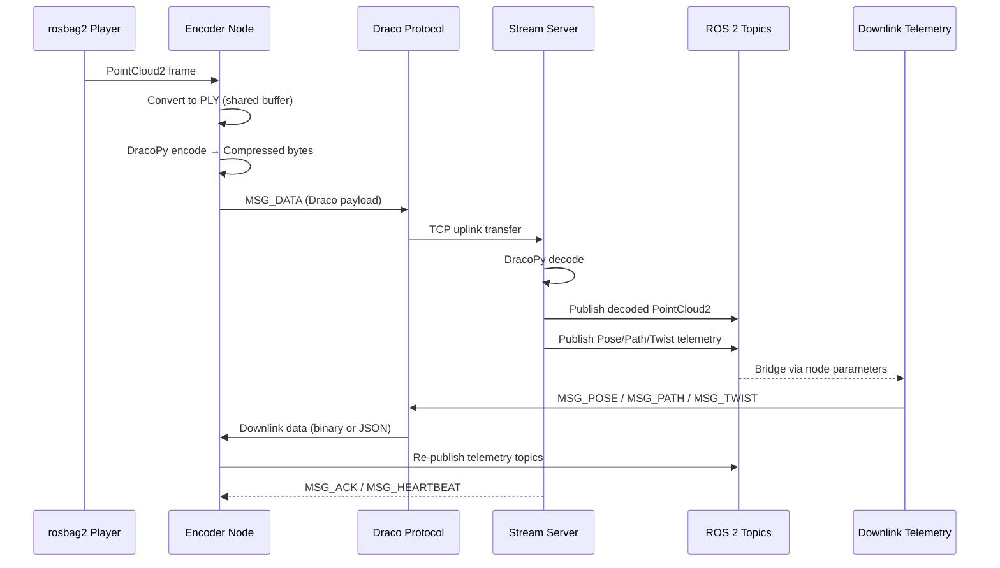
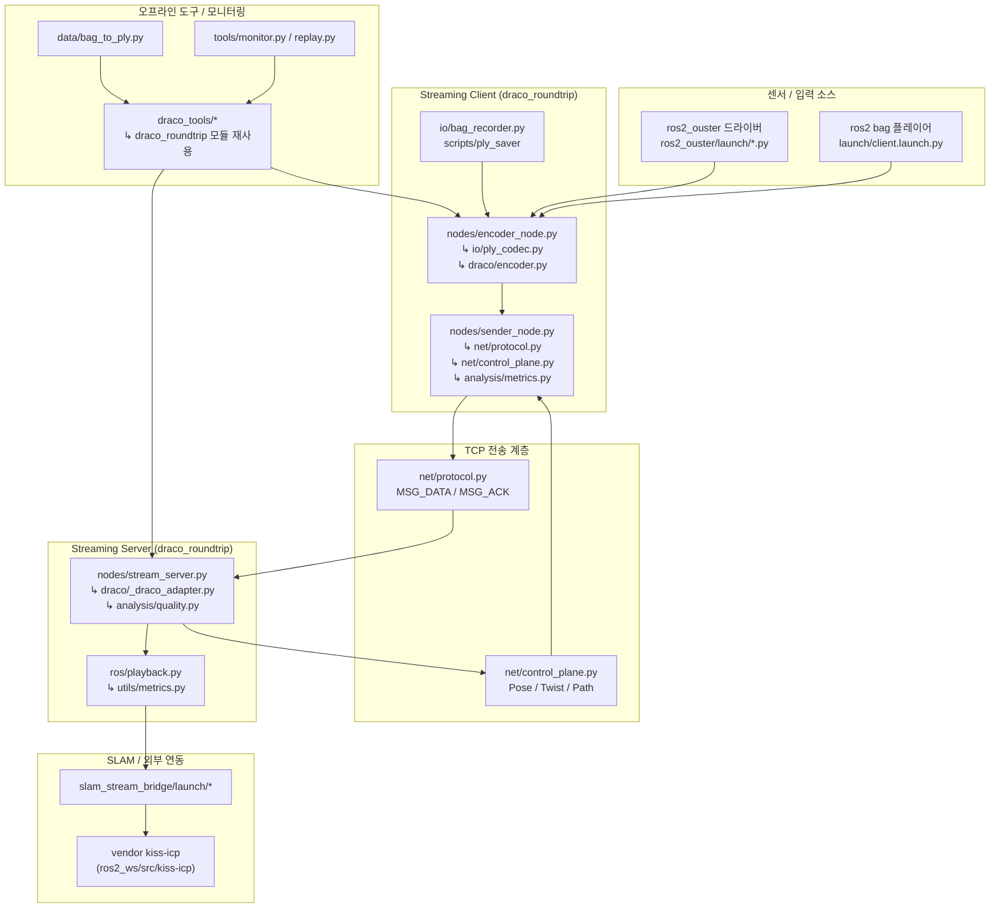

# draco-ros2-roundtrip-git

Draco(구글의 3D 압축 라이브러리)를 이용해 LiDAR 포인트클라우드를 스트리밍하고 복원 품질을 검증하는 ROS 2 워크스페이스입니다. rosbag에 담긴 포인트클라우드를 PLY로 변환 → Draco로 압축 → TCP를 통해 서버에 전송 → 복원된 포인트클라우드를 다시 ROS 토픽으로 재생하는 전체 라운드트립 파이프라인을 제공합니다.

## 시스템 개요
- **목표**: 제한된 네트워크 환경에서 3D 포인트클라우드를 실시간 스트리밍하면서도 복원 품질을 모니터링합니다.
- **핵심 역할**: 로봇(클라이언트)은 포인트클라우드를 압축해 업링크로 전송하고, 서버는 복원 및 분석 후 ROS 토픽으로 재배포하며 제어·경로 정보를 다운링크로 돌려줍니다.
- **파이프라인 범위**: 오프라인 PLY 전처리 → 실시간 인코더 노드 → TCP 전송(커스텀 프로토콜) → 서버 디코딩 → ROS 생태계와 SLAM 애플리케이션 연동.
- **라이브 센서 연동**: Ouster OS 시리즈와 같은 LiDAR를 `ros2_ouster` 드라이버로 바로 수집해 동일한 스트리밍 경로에 투입할 수 있습니다.

## 아키텍처 다이어그램

```mermaid
flowchart LR
    subgraph Robot["로봇 / 클라이언트"]
        bag[rosbag2 Player]
        encoder[Encoder Node<br/>draco_roundtrip.nodes.encoder_node]
        compressor[DracoPy Encoder]
        uplink["Uplink TCP Socket"]
        telemetry_rx["Telemetry Subscriber<br/>(Pose/Path/Twist)"]
        bag --> encoder --> compressor --> uplink
        telemetry_rx --> encoder
    end

    subgraph Network["TCP 네트워크"]
        protocol["Custom Draco Protocol<br/>(MSG_DATA/MSG_ACK/MSG_HEARTBEAT)"]
    end

    subgraph Server["서버 / 베이스 스테이션"]
        listener["Stream Server Node<br/>draco_roundtrip.nodes.stream_server"]
        decoder[DracoPy Decoder]
        quality["Analysis Metrics<br/>draco_roundtrip.analysis"]
        ros_pub["ROS 2 Publishers<br/>(PointCloud2, Pose, Path, Twist)"]
        downlink["Control-plane Socket"]
        uplink --> protocol --> listener
        listener --> decoder --> ros_pub
        ros_pub --> quality
        listener --> downlink --> protocol
    end
```


`rosbag2 Player` 노드는 라이브 센서를 의미하는 `ros2_ouster` 드라이버로 대체 가능합니다. 두 입력 소스는 동일한 인코더/송신 파이프라인을 공유합니다.

## 시퀀스 다이어그램


## 데이터 파이프라인 요약
1. **전처리(선택적)**: `draco_tools` 패키지의 `bag_to_ply`로 rosbag을 PLY 시퀀스로 변환합니다. 실시간 실행 시에는 인코더 노드가 rosbag에서 직접 읽어 동일한 변환을 수행합니다.
2. **압축 송신**: `draco_roundtrip.nodes.encoder_node`가 PLY 버퍼를 DracoPy로 압축하고, `draco_roundtrip.net.protocol`이 정의한 프레이밍(MSG_DATA, MSG_HEARTBEAT 등)을 사용해 TCP uplink로 전송합니다.
3. **수신·복원**: 서버 측 `stream_server` 노드는 같은 프로토콜로 프레임을 수신하고 DracoPy로 복원하며, ROS 토픽(`/stream_pair/source`, `/stream_pair/decoded`)으로 퍼블리시합니다.
4. **품질 분석**: `draco_roundtrip.analysis` 모듈이 복원된 프레임을 기준으로 Chamfer-like metric을 계산하고, 필요 시 PNG 리포트 및 로그를 생성합니다.
5. **제어 피드백**: 서버가 SLAM/제어 스택에서 생성한 `Pose`, `Twist`, `NavPath` 정보를 다운링크 소켓으로 밀어주고, 클라이언트는 이를 ROS 토픽으로 다시 퍼블리시하여 제어 루프에 반영합니다.
6. **라이브 센서 모드**: `ros2_ouster` 드라이버가 `/points` 토픽을 퍼블리시하면 인코더는 `qos_best_effort` 설정에 따라 스트림을 소비하고, rosbag 없이도 동일한 왕복 경로를 실행합니다.

## 시스템 구조도


각 노드는 실질적으로 사용하는 하위 모듈을 함께 표기했습니다. `draco_tools` 및 CLI 스크립트는 `draco_roundtrip` 내부 구현을 재사용하며, SLAM 브리지는 `stream_server`가 퍼블리시하는 토픽을 KISS-ICP 등 외부 패키지에 연결합니다.

## 주요 구성 요소
- `draco_roundtrip`
  - `io/`: `ply_codec.py`, `bag_recorder.py` 등 PLY 로딩·저장과 rosbag 추출 로직을 제공합니다.
  - `draco/`: `encoder.py`에 Draco 인코딩 기능이 모듈화되어 스트리밍/배치가 공유합니다.
  - `net/`: `protocol.py`에 TCP 메시지 정의가 정리되어 클라이언트/서버가 같은 프레이밍을 사용합니다.
  - `ros/`: `playback.py` 등 ROS 퍼블리싱 헬퍼가 위치하며, 노드/도구가 공통 코드를 사용합니다.
  - `analysis/`: Chamfer-like metric 계산과 품질 요약 함수를 제공하여 온라인/오프라인 품질 검증이 일원화되었습니다.
  - `nodes/`, `tools/`, `cli/`: ROS 2 노드와 CLI 엔트리 포인트가 위 모듈을 import 하도록 정리되어 있습니다.
- `draco_tools`
  - 기존 CLI는 `draco_roundtrip` 모듈을 thin wrapper 로 호출해, ROS 패키지 호환성을 유지하면서도 단일 코드베이스를 사용합니다.
- `ros2_ouster_drivers`
  - `ros2_ouster` 패키지를 통해 Ouster OS 시리즈 라이더를 직접 구동하며 `/points` 토픽을 퍼블리시합니다. `client_ouster.launch.py`가 기본 설정을 사용합니다.
- `kiss-icp`
  - PRBonn KISS-ICP 구현이 vendor 형태로 포함되어 SLAM 브리지 패키지(`slam_stream_bridge`)와 런치 파일에서 바로 사용할 수 있습니다.
- `slam_stream_bridge`: SLAM 실험과 연동할 수 있는 런치 파일 모음

## 사전 준비
1. **ROS 2**: Humble(권장) 또는 호환 버전 설치 후 `source /opt/ros/<distro>/setup.bash` 로 환경을 불러옵니다.
2. **DracoPy**: Python용 Draco 바인딩인 [`DracoPy`](https://pypi.org/project/DracoPy/)를 설치합니다. `pip install DracoPy` 후 `python -c "import DracoPy"`가 성공하면 준비 완료입니다. 외부 `draco_encoder`/`draco_decoder` 바이너리는 더 이상 필요하지 않습니다.
3. **Python 의존성**: `numpy`, `plyfile`, `scipy`, `open3d` 등이 필요합니다. 시스템 패키지 또는 `pip install numpy plyfile scipy open3d`로 설치하세요.
4. **데이터**: 테스트 rosbag을 `data/bags/` 아래에 배치합니다. (예시: `data/bags/rosbag2_2024_09_24-14_28_57/`)
5. **KISS-ICP 의존성**: SLAM 연동 런치에 필요한 [PRBonn/kiss-icp](https://github.com/PRBonn/kiss-icp) 패키지가 `ros2_ws/src/kiss-icp`에 포함되어 있습니다. 원저장소의 최신 기능이 필요하다면 직접 `git pull` 또는 `git remote -v`를 활용해 업데이트할 수 있습니다.
6. **Ouster 라이브 스트리밍(선택)**: 실시간 센서를 사용할 경우 `ros2_ouster` 패키지의 `params/driver_config.yaml`을 센서 IP와 네트워크 환경에 맞게 수정하고, 센서가 동일 네트워크에서 동작 중인지 확인합니다. 필요 시 [Ouster 공식 문서](https://github.com/ouster-lidar/ouster-ros)를 참고해 방화벽 및 멀티캐스트 설정을 맞춰 주세요.

## 빌드 절차
```bash
source /opt/ros/humble/setup.bash
cd /home/kkit/newdisk/draco_tcpip/ros2_ws
colcon build --symlink-install
source install/setup.bash
```
`~/.bashrc` 에 위 두 개의 `source` 명령과 PATH 설정을 추가해 두면 새 터미널에서도 바로 `ros2 run` 명령을 사용할 수 있습니다.

## 실행 방법
### 서버-센트릭 스트리밍 파이프라인 (분산 환경)
리팩터링된 양방향 프로토콜은 서버와 로봇이 서로 다른 PC에서 동작하도록 설계되었습니다. 각 PC에서 아래 단계를 따라 두 노드를 실행하세요.

**1. 서버 PC (고성능 머신)**

```bash
source /opt/ros/humble/setup.bash
cd /home/kkit/newdisk/draco_tcpip/ros2_ws
source install/setup.bash
ros2 launch draco_roundtrip server.launch.py [port:=5000]
```

- `port` (옵션): 업링크(TCP) 포트. 기본값은 `5000`이며, `downlink_port`를 지정하지 않으면 다운링크 포트가 자동으로 `port + 1` 로 계산됩니다.
- `downlink_port` (옵션): 다운링크 제어 포트. `0`(기본값)으로 두면 서버 노드가 실행 시점에 `port + 1`을 사용합니다.
- `points_topic` (옵션): 복원된 포인트클라우드를 퍼블리시할 토픽 이름. 기본값은 `/stream_pair/decoded`입니다.
- `points_frame_id` (옵션): 복원된 포인트클라우드의 Frame ID. 기본값은 `lidar_frame`입니다.
- `downlink_protocol` (옵션): 다운링크 프로토콜(`binary` 또는 `json`). 기본값은 `binary`입니다.
- `downlink_rate` (옵션): 다운링크 텔레메트리 주기(Hz). 기본값은 `10.0`입니다.

**2. 클라이언트 PC (로봇)**

```bash
source /opt/ros/humble/setup.bash
cd /home/kkit/newdisk/draco_tcpip/ros2_ws
source install/setup.bash
ros2 launch draco_roundtrip client.launch.py \
    server_host:=192.168.3.16 \
    server_port:=5000 \
    bag_file:=/home/kkit/newdisk/draco_tcpip/ros2_ws/data/bags/rosbag2_2024_09_24-14_28_57 \
    topic_name:=/sensing/lidar/top/pointcloud \
    prefix:=client_test
```

- `server_host` (필수): 서버 PC의 IP 또는 호스트명. 다운링크 접속에도 동일 값이 사용됩니다.
- `server_port` (옵션): 서버 런치에서 사용한 업링크 포트(기본값 `5000`). 다운링크 포트는 자동으로 `server_port + 1` 로 설정됩니다.
- `bag_file` (필수): 스트리밍할 rosbag2 디렉터리 또는 DB3 파일의 절대 경로.
- `topic_name` (필수): rosbag 안의 `sensor_msgs/msg/PointCloud2` 토픽 이름.
- `qos_best_effort` (옵션, 기본 `false`): rosbag 기록이 Best Effort QoS로 만들어졌다면 구독 QoS를 일치시켜 드롭을 줄일 수 있습니다.
- `idle_shutdown_timeout` (옵션, 기본 `5.0`): 입력이 끊긴 뒤 지정 초가 지나면 `sender_node`가 종료됩니다. 무한 대기하려면 `0`으로 두세요.
- `loop` (옵션, 기본 `false`): rosbag을 반복 재생합니다.
- `compress_level`, `position_quantization_bits`, `generic_quantization_bits` (옵션): Draco 인코더 압축 단계 및 포지션/제너릭 양자화 비트를 제어합니다.
- `work_dir`, `encoder`, `telemetry_rate` 등의 추가 인자는 런치 인자로 전달하면 해당 ROS 2 파라미터가 설정됩니다.

**3. SLAM (옵션)**

클라이언트가 서버와 통신 중이라면, 별도 터미널에서 KISS-ICP 오도메트리를 실행해 복원 포인트클라우드를 처리할 수 있습니다.

```bash
ros2 launch slam_stream_bridge kiss_icp.launch.py \
    topic:=/stream_pair/decoded \
    base_frame:=lidar_frame \
    visualize:=true \
    use_sim_time:=true
```

- `topic` (옵션, 기본 `/stream_pair/decoded`): SLAM 입력으로 사용할 포인트클라우드 토픽.
- `base_frame` (옵션, 기본 `lidar_frame`): TF 트리에서 SLAM 기준 프레임.
- `visualize` (옵션, 기본 `true`): `true`면 RViz2를 함께 띄웁니다.
- `use_sim_time` (옵션, 기본 `true`): 시뮬레이션 시간 사용 여부.

### GUI 기반 제어 패널
터미널 명령 대신 GUI에서 인코더/디코더 옵션을 조정하고 서버와 클라이언트 SLAM 파이프라인을 실행·종료하려면 새로 추가된 `stream_control` 콘솔 스크립트를 사용하세요.

```bash
source /opt/ros/humble/setup.bash
cd /home/kkit/newdisk/draco_tcpip/ros2_ws
source install/setup.bash
ros2 run draco_roundtrip stream_control
```

- **Encoder Controls**: `Compression Level`, `Position QBits`, `Generic QBits` 스핀박스를 통해 `encoder_node`의 `cl`, `qp`, `qg` 파라미터를 즉시 지정할 수 있습니다.
- **Server Controls**: 디코더 측 `points_topic`, `points_frame_id`, `downlink_protocol`, `downlink_rate` 등을 GUI에서 설정 후 서버를 실행합니다.
- **Process Management**: `Start/Stop Server`, `Start/Stop Client`, `Start/Stop SLAM` 버튼이 각각 서버 런치, 클라이언트 런치, KISS-ICP 런치를 독립적으로 구동/종료합니다. 창을 닫으면 실행 중인 프로세스를 모두 안전하게 종료합니다.
- **Bag 선택 지원**: `Browse` 버튼으로 rosbag2 DB3 파일을 선택하면 경로에 공백이 있어도 자동으로 런치 인자에 인용부호를 추가합니다.

GUI는 단일 워크스테이션에서 서버와 클라이언트를 함께 실행할 때 유용하며, 분산 환경에서는 SSH 포워딩 또는 X11 터널링을 통해 동일한 명령을 사용할 수 있습니다.

**실시간 Ouster 센서(옵션)**

`ros2_ouster` 드라이버와 스트리밍 노드를 동시에 실행하려면:

```bash
source /opt/ros/humble/setup.bash
cd /home/kkit/newdisk/draco_tcpip/ros2_ws
source install/setup.bash
ros2 launch draco_roundtrip client_ouster.launch.py \
    server_host:=192.168.3.16 \
    server_port:=5000 \
    prefix:=robot1 \
    telemetry_rate:=10.0 \
    idle_shutdown_timeout:=0.0 \
    driver_params_file:=/home/kkit/newdisk/draco_tcpip/ros2_ws/src/ros2_ouster_drivers/ros2_ouster/params/driver_config.yaml \
    pointcloud_topic:=/points \
    qos_best_effort:=true
```

- `driver_params_file`: 센서 IP, 포트, 모드를 정의한 YAML. 센서 환경에 맞춰 수정하세요.
- `pointcloud_topic`: 드라이버가 퍼블리시하는 `PointCloud2` 토픽 이름. 기본값은 `/points`입니다.
- `qos_best_effort`: 라이브 센서 노이즈로 인해 패킷 유실이 발생할 수 있으므로 Best Effort를 사용하는 것이 일반적입니다.
- `idle_shutdown_timeout`: 라이브 모드에서 `0`으로 두면 지속 실행합니다.

각 런치 파일은 ROS 2 파라미터 기반으로 노드를 구성합니다. 세부 동작을 바꾸고 싶다면 `ros2 launch ... telemetry_rate:=5.0` 처럼 런치 인자에서 원하는 값을 덮어쓰거나, `--ros-args --params-file custom.yaml` 을 추가해 YAML 파라미터 파일을 전달하면 됩니다. 클라이언트가 실행되면 `data/ply_stream/`에 생성된 PLY 파일을 인코딩한 뒤 서버로 전송하고, 서버에서 돌려받은 복원 결과는 `data/decoded_from_server/`에 저장되며 동시에 ROS 토픽(`stream_pair/source`, `stream_pair/decoded`)으로 퍼블리시됩니다. RViz에서 두 토픽을 비교하면 복원 품질을 시각적으로 확인할 수 있습니다.

### 3. 보조 유틸리티
- PLY 생성만 필요한 경우:
  ```bash
  source /opt/ros/humble/setup.bash
  cd /home/kkit/newdisk/draco_tcpip/ros2_ws
  source install/setup.bash
  ros2 run draco_tools bag_to_ply --topic /sensing/lidar/top/pointcloud --out data/ply --best-effort
  ```
- SLAM 연동 런치 예시:
  ```bash
  source /opt/ros/humble/setup.bash
  cd /home/kkit/newdisk/draco_tcpip/ros2_ws
  source install/setup.bash
  ros2 launch slam_stream_bridge hdl_graph_slam_stream.launch.py
  ```

각 노드/스크립트는 `--help` 옵션으로 세부 인자를 확인할 수 있습니다.

## 디렉터리 구조
- `configs/`: 스트리밍 프로파일, QoS 오버라이드, 네트워크 에뮬레이션 설정이 정리되어 있습니다.
- `data/`: 실험 산출물과 맵 데이터를 보관합니다. `.gitignore` 처리로 자유롭게 활용 가능합니다.
- `docs/`: 아키텍처 설명, 마이그레이션 가이드, 레퍼런스 노트가 정리되어 있습니다.
- `ros2_ws/src/draco_roundtrip`: 인코더/송신/서버 노드와 런치 파일이 위치한 핵심 패키지입니다.
- `ros2_ws/src/draco_tools`: rosbag ↔︎ PLY 변환 등 오프라인 유틸리티가 포함됩니다.
- `ros2_ws/src/ros2_ouster_drivers/ros2_ouster`: Ouster 공식 드라이버에서 포크된 ROS 2 드라이버와 설정 파일이 포함되어 라이브 센서를 구동합니다.
- `ros2_ws/src/kiss-icp`: SLAM 브리지를 위한 PRBonn KISS-ICP 구현이 vendor 형태로 제공됩니다.
- `ros2_ws/src/slam_stream_bridge`: RTAB-Map, HDL Graph SLAM 등과의 통합 런치 파일 및 노드를 제공합니다.
- `ros2_ws/build`, `ros2_ws/install`, `ros2_ws/log`: `colcon build` 수행 시 생성되는 바이너리/로그 산출물입니다. 필요 시 `colcon build --merge-install` 등으로 재생성하면 됩니다.

## 문제 해결
- **QoS mismatch**로 메시지가 수신되지 않을 경우, `client.launch.py`에서는 `qos_best_effort:=true` 또는 `telemetry_rate`를 조정해 확인하고, rosbag 재생 시 `--qos-profile-overrides-path` 옵션을 사용해 출판 QoS를 일치시켜 보세요.
- `.ros/log` 가 가득 차 Permission 오류가 발생하면 `rm -rf ~/.ros/log/*` 로 정리한 뒤 다시 실행합니다.
- Draco 실행 파일을 찾지 못하면 PATH 또는 환경 변수를 재확인하세요 (`which draco_encoder` 로 확인 가능).

## 참고
- 프로젝트의 모든 스크립트는 ASCII 기반이며, ROS 2 패키지는 `colcon build --symlink-install`로 동적 링크된 상태를 유지합니다.
- 버그나 개선 사항은 Issue/PR로 남겨 주세요.
