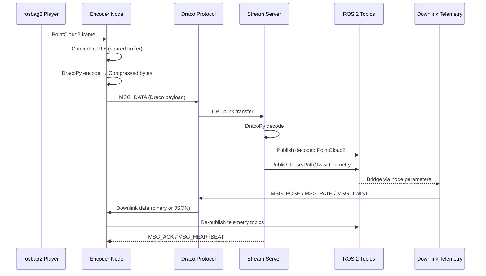

# draco-ros2-roundtrip-git

Draco(구글의 3D 압축 라이브러리)를 이용해 LiDAR 포인트클라우드를 스트리밍하고 복원 품질을 검증하는 ROS 2 워크스페이스입니다. rosbag에 담긴 포인트클라우드를 PLY로 변환 → Draco로 압축 → TCP를 통해 서버에 전송 → 복원된 포인트클라우드를 다시 ROS 토픽으로 재생하는 전체 라운드트립 파이프라인을 제공합니다.

## 시스템 개요
- **목표**: 제한된 네트워크 환경에서 3D 포인트클라우드를 실시간 스트리밍하면서도 복원 품질을 모니터링합니다.
- **핵심 역할**: 로봇(클라이언트)은 포인트클라우드를 압축해 업링크로 전송하고, 서버는 복원 및 분석 후 ROS 토픽으로 재배포하며 제어·경로 정보를 다운링크로 돌려줍니다.
- **파이프라인 범위**: 오프라인 PLY 전처리 → 실시간 인코더 노드 → TCP 전송(커스텀 프로토콜) → 서버 디코딩 → ROS 생태계와 SLAM 애플리케이션 연동.

## 아키텍처 다이어그램

```mermaid
flowchart LR
    subgraph Robot["로봇 / 클라이언트"]
        bag[rosbag2 Player]
        encoder[Encoder Node<br/>draco_roundtrip.nodes.encoder_node]
        compressor[DracoPy Encoder]
        uplink["Uplink TCP Socket"]
        telemetry_rx["Telemetry Subscriber<br/>(Pose/Path/Twist)"]
        bag --> encoder --> compressor --> uplink
        telemetry_rx --> encoder
    end

    subgraph Network["TCP 네트워크"]
        protocol["Custom Draco Protocol<br/>(MSG_DATA/MSG_ACK/MSG_HEARTBEAT)"]
    end

    subgraph Server["서버 / 베이스 스테이션"]
        listener["Stream Server Node<br/>draco_roundtrip.nodes.stream_server"]
        decoder[DracoPy Decoder]
        quality["Analysis Metrics<br/>draco_roundtrip.analysis"]
        ros_pub["ROS 2 Publishers<br/>(PointCloud2, Pose, Path, Twist)"]
        downlink["Control-plane Socket"]
        uplink --> protocol --> listener
        listener --> decoder --> ros_pub
        ros_pub --> quality
        listener --> downlink --> protocol
    end
```


## 시퀀스 다이어그램


## 데이터 파이프라인 요약
1. **전처리(선택적)**: `draco_tools` 패키지의 `bag_to_ply`로 rosbag을 PLY 시퀀스로 변환합니다. 실시간 실행 시에는 인코더 노드가 rosbag에서 직접 읽어 동일한 변환을 수행합니다.
2. **압축 송신**: `draco_roundtrip.nodes.encoder_node`가 PLY 버퍼를 DracoPy로 압축하고, `draco_roundtrip.net.protocol`이 정의한 프레이밍(MSG_DATA, MSG_HEARTBEAT 등)을 사용해 TCP uplink로 전송합니다.
3. **수신·복원**: 서버 측 `stream_server` 노드는 같은 프로토콜로 프레임을 수신하고 DracoPy로 복원하며, ROS 토픽(`/stream_pair/source`, `/stream_pair/decoded`)으로 퍼블리시합니다.
4. **품질 분석**: `draco_roundtrip.analysis` 모듈이 복원된 프레임을 기준으로 Chamfer-like metric을 계산하고, 필요 시 PNG 리포트 및 로그를 생성합니다.
5. **제어 피드백**: 서버가 SLAM/제어 스택에서 생성한 `Pose`, `Twist`, `NavPath` 정보를 다운링크 소켓으로 밀어주고, 클라이언트는 이를 ROS 토픽으로 다시 퍼블리시하여 제어 루프에 반영합니다.

## 주요 구성 요소
- `draco_roundtrip`
  - `io/`: `ply_codec.py`, `bag_recorder.py` 등 PLY 로딩·저장과 rosbag 추출 로직을 제공합니다.
  - `draco/`: `encoder.py`에 Draco 인코딩 기능이 모듈화되어 스트리밍/배치가 공유합니다.
  - `net/`: `protocol.py`에 TCP 메시지 정의가 정리되어 클라이언트/서버가 같은 프레이밍을 사용합니다.
  - `ros/`: `playback.py` 등 ROS 퍼블리싱 헬퍼가 위치하며, 노드/도구가 공통 코드를 사용합니다.
  - `analysis/`: Chamfer-like metric 계산과 품질 요약 함수를 제공하여 온라인/오프라인 품질 검증이 일원화되었습니다.
  - `nodes/`, `tools/`, `cli/`: ROS 2 노드와 CLI 엔트리 포인트가 위 모듈을 import 하도록 정리되어 있습니다.
- `draco_tools`
  - 기존 CLI는 `draco_roundtrip` 모듈을 thin wrapper 로 호출해, ROS 패키지 호환성을 유지하면서도 단일 코드베이스를 사용합니다.
- `slam_stream_bridge`: SLAM 실험과 연동할 수 있는 런치 파일 모음

## 사전 준비
1. **ROS 2**: Humble(권장) 또는 호환 버전 설치 후 `source /opt/ros/<distro>/setup.bash` 로 환경을 불러옵니다.
2. **DracoPy**: Python용 Draco 바인딩인 [`DracoPy`](https://pypi.org/project/DracoPy/)를 설치합니다. `pip install DracoPy` 후 `python -c "import DracoPy"`가 성공하면 준비 완료입니다. 외부 `draco_encoder`/`draco_decoder` 바이너리는 더 이상 필요하지 않습니다.
3. **Python 의존성**: `numpy`, `plyfile`, `scipy`, `open3d` 등이 필요합니다. 시스템 패키지 또는 `pip install numpy plyfile scipy open3d`로 설치하세요.
4. **데이터**: 테스트 rosbag을 `data/bags/` 아래에 배치합니다. (예시: `data/bags/rosbag2_2024_09_24-14_28_57/`)
5. **KISS-ICP 의존성**: SLAM 연동 런치에 필요한 [PRBonn/kiss-icp](https://github.com/PRBonn/kiss-icp) 패키지가 `ros2_ws/src/kiss-icp`에 포함되어 있습니다. 원저장소의 최신 기능이 필요하다면 직접 `git pull` 또는 `git remote -v`를 활용해 업데이트할 수 있습니다.

## 빌드 절차
```bash
source /opt/ros/humble/setup.bash
cd /home/kkit/newdisk/draco_tcpip/ros2_ws
colcon build --symlink-install
source install/setup.bash
```
`~/.bashrc` 에 위 두 개의 `source` 명령과 PATH 설정을 추가해 두면 새 터미널에서도 바로 `ros2 run` 명령을 사용할 수 있습니다.

## 실행 방법
### 서버-센트릭 스트리밍 파이프라인 (분산 환경)
리팩터링된 양방향 프로토콜은 서버와 로봇이 서로 다른 PC에서 동작하도록 설계되었습니다. 각 PC에서 아래 단계를 따라 두 노드를 실행하세요.

**1. 서버 PC (고성능 머신)**

```bash
source /opt/ros/humble/setup.bash
cd /home/kkit/newdisk/draco_tcpip/ros2_ws
source install/setup.bash
ros2 launch draco_roundtrip server.launch.py [port:=5000]
```

- `port` (옵션): 업링크(TCP) 포트. 기본값은 `5000`이며, `downlink_port`를 지정하지 않으면 다운링크 포트가 자동으로 `port + 1` 로 계산됩니다.
- `downlink_port` (옵션): 다운링크 제어 포트. `0`(기본값)으로 두면 서버 노드가 실행 시점에 `port + 1`을 사용합니다.

**2. 클라이언트 PC (로봇)**

```bash
source /opt/ros/humble/setup.bash
cd /home/kkit/newdisk/draco_tcpip/ros2_ws
source install/setup.bash
ros2 launch draco_roundtrip client.launch.py \
    server_host:=192.168.3.16 \
    server_port:=5000 \
    bag_file:=/home/kkit/newdisk/draco_tcpip/ros2_ws/data/bags/rosbag2_2024_09_24-14_28_57 \
    topic_name:=/sensing/lidar/top/pointcloud \
    prefix:=client_test
```

- `server_host` (필수): 서버 PC의 IP 또는 호스트명. 다운링크 접속에도 동일 값이 사용됩니다.
- `server_port` (옵션): 서버 런치에서 사용한 업링크 포트(기본값 `5000`). 다운링크 포트는 자동으로 `server_port + 1` 로 설정됩니다.
- `bag_file` (필수): 스트리밍할 rosbag2 디렉터리 또는 DB3 파일의 절대 경로.
- `topic_name` (필수): rosbag 안의 `sensor_msgs/msg/PointCloud2` 토픽 이름.
- `work_dir`, `encoder`, `telemetry_rate` 등의 추가 인자는 런치 인자로 전달하면 해당 ROS 2 파라미터가 설정됩니다.

각 런치 파일은 ROS 2 파라미터 기반으로 노드를 구성합니다. 세부 동작을 바꾸고 싶다면 `ros2 launch ... telemetry_rate:=5.0` 처럼 런치 인자에서 원하는 값을 덮어쓰거나, `--ros-args --params-file custom.yaml` 을 추가해 YAML 파라미터 파일을 전달하면 됩니다. 클라이언트가 실행되면 `data/ply_stream/`에 생성된 PLY 파일을 인코딩한 뒤 서버로 전송하고, 서버에서 돌려받은 복원 결과는 `data/decoded_from_server/`에 저장되며 동시에 ROS 토픽(`stream_pair/source`, `stream_pair/decoded`)으로 퍼블리시됩니다. RViz에서 두 토픽을 비교하면 복원 품질을 시각적으로 확인할 수 있습니다.

### 3. 보조 유틸리티
- PLY 생성만 필요한 경우:
  ```bash
  source /opt/ros/humble/setup.bash
  cd /home/kkit/newdisk/draco_tcpip/ros2_ws
  source install/setup.bash
  ros2 run draco_tools bag_to_ply --topic /sensing/lidar/top/pointcloud --out data/ply --best-effort
  ```
- SLAM 연동 런치 예시:
  ```bash
  source /opt/ros/humble/setup.bash
  cd /home/kkit/newdisk/draco_tcpip/ros2_ws
  source install/setup.bash
  ros2 launch slam_stream_bridge hdl_graph_slam_stream.launch.py
  ```

각 노드/스크립트는 `--help` 옵션으로 세부 인자를 확인할 수 있습니다.

## 디렉터리 구조
- 루트에서 `tree -L 2` 실행 결과
  ```bash
  $ tree -L 2
  .
  ├── configs
  │   ├── client.profile.yaml
  │   ├── draco.json
  │   ├── hdl_graph_slam_stream.yaml
  │   ├── netem.profiles.yaml
  │   ├── qos_override.yaml
  │   ├── ros_topics.yaml
  │   ├── rtabmap_stream.yaml
  │   └── server.profile.yaml
  ├── data
  │   ├── bags
  │   ├── bags_keep
  │   ├── client_tmp
  │   ├── decoded_from_server
  │   ├── ply_stream
  │   ├── results
  │   └── server_tmp
  ├── docs
  │   ├── 3d_slam_setup.md
  │   ├── apps_legacy
  │   ├── HOWTO.md
  │   ├── results_template.md
  │   └── webui
  ├── draco-ros2-roundtrip
  │   ├── analysis
  │   ├── apps
  │   ├── configs
  │   ├── data
  │   ├── docs
  │   ├── launch
  │   ├── logs
  │   ├── Makefile
  │   ├── offline_pipeline.py
  │   ├── pcd_diff.log
  │   ├── qos_override.yaml
  │   ├── README.md
  │   ├── requirements.txt
  │   ├── scripts
  │   └── webui
  ├── logs
  │   ├── ros
  │   └── runs
  ├── migrate_refactor.sh
  ├── README.md
  ├── README.md.keep
  ├── refac.md
  ├── ros2_ws
  │   ├── build
  │   ├── install
  │   ├── log
  │   └── src
  ├── scripts
  │   ├── ddscycle.sh
  │   ├── netem_apply.sh
  │   ├── run_client.sh
  │   ├── run_server.sh
  │   └── summarize.sh
  └── tmp_ply
  
  32 directories, 26 files
  ```

- 주요 하위 디렉터리 샘플
  ```bash
  $ tree data/bags -L 2
  data/bags
  ├── rosbag2_2024_09_24-14_28_57
  │   ├── metadata.yaml
  │   └── rosbag2_2024_09_24-14_28_57_0.db3
  └── rosbag2_2024_09_24-14_30_22
      ├── metadata.yaml
      └── rosbag2_2024_09_24-14_30_22_0.db3
  
  2 directories, 4 files
  
  $ tree ros2_ws/src -L 2
  ros2_ws/src
  ├── draco_roundtrip
  │   ├── draco_roundtrip
  │   ├── package.xml
  │   ├── resource
  │   ├── setup.cfg
  │   └── setup.py
  ├── draco_tools
  │   ├── draco_tools
  │   ├── package.xml
  │   ├── resource
  │   ├── setup.cfg
  │   └── setup.py
  └── slam_stream_bridge
      ├── package.xml
      ├── resource
      ├── setup.cfg
      ├── setup.py
      └── slam_stream_bridge
  
  9 directories, 9 files
  ```

- `data/`: rosbag, 인코딩된 `.drc`, 복원된 `.ply` 등 실험 산출물이 위치합니다. `.gitignore` 대상이므로 자유롭게 사용 가능합니다.
- `logs/`: 실행 로그 저장 위치. 필요 시 비우고 다시 사용하세요.
- `ros2_ws/`: ROS 2 패키지 소스 및 빌드 아티팩트가 있는 워크스페이스 루트입니다.

## 문제 해결
- **QoS mismatch**로 메시지가 수신되지 않을 경우, 클라이언트를 `--reliable` 로 실행하거나 rosbag을 재생할 때 다른 QoS 설정을 사용해 보세요.
- `.ros/log` 가 가득 차 Permission 오류가 발생하면 `rm -rf ~/.ros/log/*` 로 정리한 뒤 다시 실행합니다.
- Draco 실행 파일을 찾지 못하면 PATH 또는 환경 변수를 재확인하세요 (`which draco_encoder` 로 확인 가능).

## 참고
- 프로젝트의 모든 스크립트는 ASCII 기반이며, ROS 2 패키지는 `colcon build --symlink-install`로 동적 링크된 상태를 유지합니다.
- 버그나 개선 사항은 Issue/PR로 남겨 주세요.
