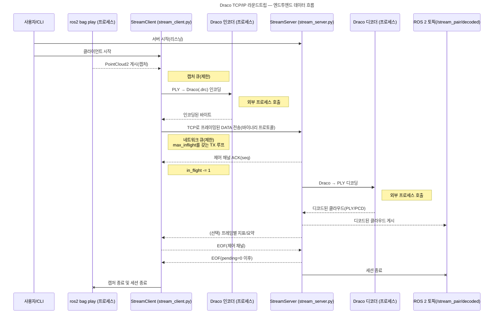

# 아키텍처 설계 및 지연 시간 계획 (Spec-Driven)
비동기 스트리밍 파이프라인, 제어 플레인 계약, 지연 최소화 전략을 요약하고 실행/검증 기준을 명시합니다.

## 1. 목표와 원칙
- **지연 최소화**: 캡처→인코드→전송→디코드→퍼블리시를 제한 큐와 워커로 병렬화해 p95 지연 250 ms 이하를 목표로 한다.
- **단일 제어 플레인**: DATA/ACK/HEARTBEAT/EOF/ERROR 프레임을 단일 TCP 소켓에서 다중화하며, v2 헤더(`magic=b"DRC0"`, `version=2`)를 기본으로 사용한다.
- **안전한 메모리/조각화**: `--tx-fragment-size`가 활성화될 때 MTU 안전 조각(256–1400 B)을 사용하고, 서버 프래그먼트 버퍼는 TTL·상한으로 GC한다.
- **호환성 유지**: Python 노드와 향후 rclcpp/Asio 이행을 동시에 고려하며, CLI/런치/문서에서 동일한 플래그와 경로 규칙을 사용한다.

### 품질 특성 보증 매핑
아키텍처 결정이 품질 특성에 어떻게 기여하는지와 증거를 한눈에 검증할 수 있도록 정리했습니다. 변경 시 [`Quality_Attributes_Catalog`](../reference/Quality_Attributes_Catalog.md) 표를 함께 갱신합니다.

| 품질 특성 | 아키텍처 훅 | 증거/검증 |
| --- | --- | --- |
| 성능·확장성 | 제한 큐, `max_inflight`, 적응 윈도, 조각화(MTU 안전) | `tests/perf/test_latency_gate.py`, netem 프로파일에서 in-flight 감소 및 p95 < 250 ms 로그 |
| 신뢰성·안정성 | 상태 전이(EOF/FAILED), 하트비트 2 s/6 s, 프래그먼트 TTL 300 s | `tests/unit/test_fragment_buffer.py`, ROS 로그의 `pending=0` 요약 |
| 보안성 | 텍스트 프로토콜 크기 제한, 단일 소켓 제어 경고 | `tests/unit/test_text_protocol_limits.py`, 실행 로그의 drop 카운터 |
| 유지보수성·테스트 가능성 | 단일 헤더/소켓 계약, CLI 플래그 표준화 | 스키마/플래그가 [구성 참조](../reference/Configuration_Reference.md)와 일치하는지 CI 린트/도큐먼트 리뷰 |
| 운영 가능성 | EOF/ACK 요약 로그, 텔레메트리 필드(p50/p95/p99, pending) | [`docs/reports/results_template.md`](../reports/results_template.md)의 게이트 테이블을 채우는지 확인 |

## 2. 엔드투엔드 파이프라인
```
[Capture] → [Encode Worker Pool] → [TX Loop] → (TCP v2 Frame) → [RX Pump] → [Decode Pool] → [Publish]
```
- **Capture**: ROS 토픽/파일 스풀러에서 제한 큐에 프레임을 적재, 큐 초과 시 drop 또는 대기.
- **Encode**: Draco 인코더 래퍼를 워커 스레드/프로세스로 호출, 시퀀스·타임스탬프를 태깅.
- **Transmit**: 논블로킹 소켓 + `max_inflight` 윈도우, RTT EMA 기반 적응 윈도 조정.
- **Receive/Decode**: 단일 소켓에서 FrameType을 파싱해 재조립 후 디코드, 디코드 큐도 제한.
- **Publish**: ROS 토픽에 발행하고 필요 시 PLY/DRC 아티팩트를 저장(레이아웃 프로파일 기준).

## 3. 제어 플레인 및 제한 규칙
- 상태 전이: `INIT → HANDSHAKING → STREAMING → DRAINING → TERMINATED`, 오류 시 `FAILED`.
- 하트비트: 2 s 간격 송신, 6 s 무응답 시 `TIMEOUT` 코드로 종료.
- 프래그먼트 GC: TTL 300 s, GC 주기 60 s, 누적 128 MiB 초과 시 가장 오래된 항목부터 제거.
- 텍스트 프로토콜: 이름 4096 B, 페이로드 100 MiB 초과 시 즉시 종료(레거시 호환 전용).

## 4. 지연/성능 전략
1. **병렬화**: 캡처·인코드·전송의 백프레셔를 정량화하고, GIL 영향이 큰 구간은 워커 프로세스로 분리.
2. **제로카피 우선**: 공유 메모리 또는 direct publish 경로를 기본으로 하고, 실패 시 스풀러로 폴백 후 자원 정리.
3. **전송 튜닝**: `--socket-buffer-autotune`, `--tx-fragment-size`, `--adaptive-window` 조합을 문서화하고 회귀 테스트에 포함.
4. **벤치마크**: `tests/perf`에서 rosbag + netem 프로파일을 사용해 p95 지연/드롭률을 측정, 목표 미달 시 실패 로그에 재현 명령 포함.
5. **C++ 이행 경로**: rclcpp/Asio 포트를 설계해 Python GIL 병목을 제거하고, Python CLI는 동일 프로토콜 어댑터를 사용.

## 5. 완료 정의
| 단계 | 내용 | 완료 조건 |
| --- | --- | --- |
| 0 안정화 | EOF/ACK/하트비트 핸드셰이크, 제한 큐, 로그 요약 | 텔레메트리에 `pending=0`, 로그에 EOF/ACK 요약 기록 |
| 1 성능 | 적응 윈도, MTU 조각화, 버퍼 자동 튜닝 | p95 지연 < 250 ms, 드롭률 0%, 성능 게이트 통과 |
| 2 전송 실험 | QUIC/UDP-FEC 프로토타입, 우선순위 큐 | 실험 모드 `--transport` 플래그로 보호, 로그/메트릭 수집 |
| 3 미래 개선 | rclcpp/Asio 포트, 인프로세스 Draco, 대시보드 | 기능 동등성 확보, 텔레메트리 대시보드 활성 |

## 6. 시퀀스 다이어그램
<!-- AUTODOC:E2E_SEQUENCE -->
<!-- AUTODOC:E2E_SEQUENCE:BEGIN -->

<!-- AUTODOC:E2E_SEQUENCE:END -->
