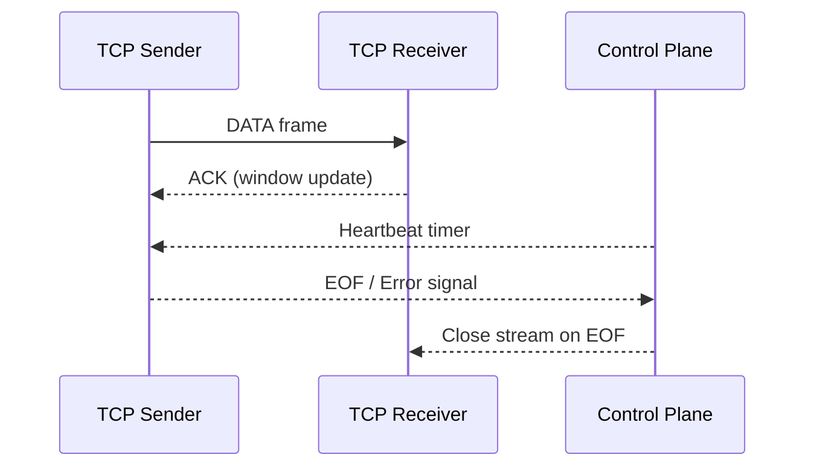
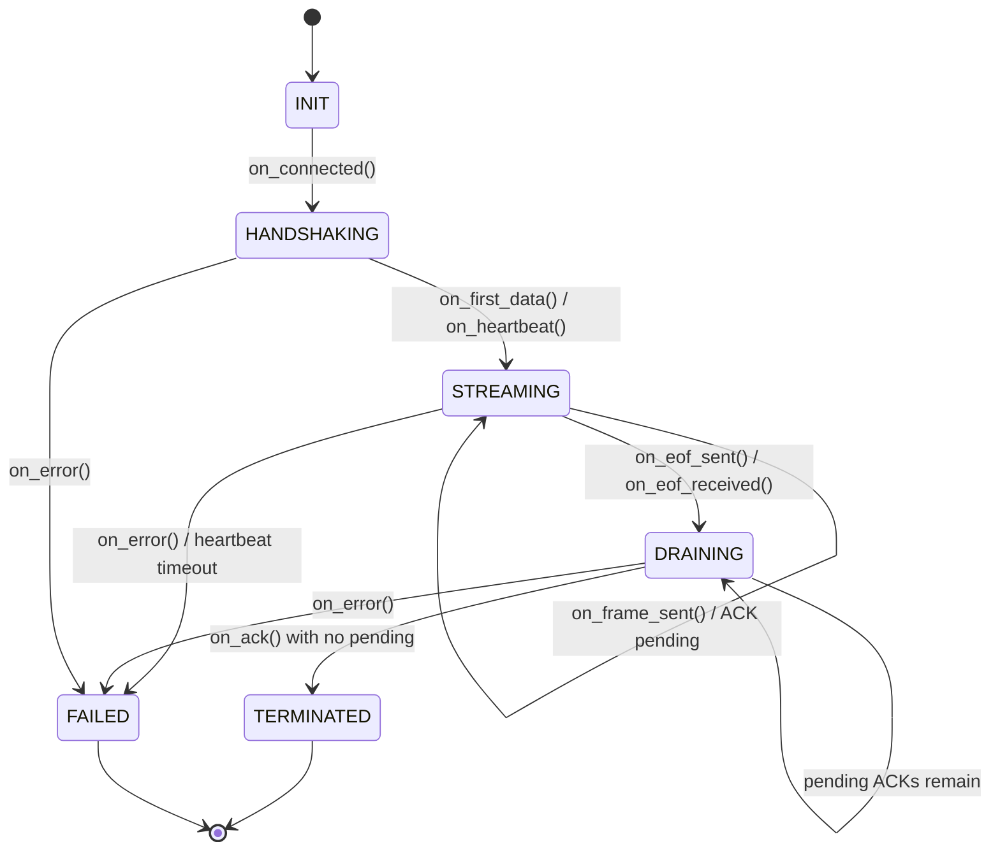

# 프로토콜 및 스키마 참조
Draco Roundtrip 스트리밍 세션을 제어하는 제어 플레인 메시지, 상태 기계, 텔레메트리 스키마를 정의합니다.
_마지막 업데이트: 2025-03-15_

**목차**
- [제어 플레인 메시지](#제어-플레인-메시지)
- [세션 상태 기계](#세션-상태-기계)
- [타이밍 및 조각화 규칙](#타이밍-및-조각화-규칙)
- [텔레메트리 스키마](#텔레메트리-스키마)
- [검증 체크리스트](#검증-체크리스트)

## 제어 플레인 메시지

### TCP 제어 시퀀스 개요

<!-- AUTODOC:TCP_CONTROL_SEQUENCE_SIMPLE -->
<!-- AUTODOC:TCP_CONTROL_SEQUENCE_SIMPLE:BEGIN -->

<!-- AUTODOC:TCP_CONTROL_SEQUENCE_SIMPLE:END -->

| 코드(16진) | 심볼 | 목적 | 페이로드 |
|------------|--------|---------|---------|
| `0x01` | `ACK` | 수신자가 데이터 프레임을 수락했음을 확인 | 8바이트 부호 없는 시퀀스(빅엔디언) |
| `0x02` | `HEARTBEAT` | 유휴 구간 동안 송신자가 살아 있음을 알림 | 선택적 8바이트 단조 증가 타임스탬프 |
| `0x03` | `EOF` | 모든 프레임 전송이 완료되었음을 알림 | 없음 |
| `0x04` | `ERROR` | 비정상 종료를 보고 | 1바이트 오류 코드 + UTF-8 메시지 |

### 오류 코드
| 코드 | 식별자 | 설명 |
|------|------------|-------------|
| `0` | `NONE` | 예약됨 |
| `1` | `PROTOCOL_VIOLATION` | 잘못된 헤더 또는 상태 전이 |
| `2` | `TIMEOUT` | ACK/HEARTBEAT가 타임아웃 한도를 초과 |
| `3` | `INTERNAL_ERROR` | 인코더/디코더 실패 |
| `4` | `SHUTDOWN` | 운영자가 요청한 정상 종료 |

## 세션 상태 기계
상태는 `INIT → HANDSHAKING → STREAMING → DRAINING → TERMINATED`로 진행되며, 오류가 발생하면 어느 상태에서든 `FAILED`로 전이할 수 있습니다.

1. `INIT` → `HANDSHAKING`: TCP 연결이 성립되며 1초 이내에 첫 하트비트 또는 데이터 프레임이 도착해야 합니다.
2. `HANDSHAKING` → `STREAMING`: 첫 데이터 프레임 또는 ACK 수신.
3. `STREAMING` → `DRAINING`: 송신자가 `EOF`를 전송하고 남은 ACK를 기다립니다.
4. `DRAINING` → `TERMINATED`: 모든 프레임이 ACK되고 큐가 비어 있음(`pending=0`).
5. 모든 상태 → `FAILED`: 오류 메시지, 타임아웃, 내부 실패.

종료 시 양측은 대기 큐, RTT, 지연 분위수를 요약한 구조화 로그를 출력합니다. `FAILED` 상태에 진입한 세션은 추가 데이터 및 제어 메시지 전송을 중단해야 합니다.

## 타이밍 및 조각화 규칙
- `ACK_TIMEOUT_S = 0.5`: RTT EMA가 조정되기 전 초기 ACK 마감 시간.
- `HEARTBEAT_INTERVAL_S = 2.0`: 해당 간격 동안 데이터 프레임이 없으면 하트비트를 전송.
- `HEARTBEAT_LIVENESS_S = 6.0`: 임계값을 초과해 하트비트가 누락되면 `TIMEOUT` 코드의 `ERROR` 발생.
- `CONTROL_POLL_INTERVAL_S = 0.05`: 제어 소켓 폴링 주기.
- 조각화: `--tx-fragment-size` > 0이면 페이로드를 256–1400바이트 조각으로 나누고 `more_fragments` 플래그를 설정합니다. 수신 측은 ACK 전 조각을 재조립합니다.

## 텔레메트리 스키마
텔레메트리 JSON에는 다음 필드가 포함되어야 하며 스키마 버전은 `1.0.0`입니다.

| 필드 | 유형 | 비고 |
|-------|------|-------|
| `schema_version` | string | 항상 `1.0.0` |
| `schema_doc` | string | 본 문서 경로를 참조해야 함 |
| `session.id` | string | 고유 세션 식별자 |
| `session.role` | string | `"client"` 또는 `"server"` |
| `session.transport` | string | `--transport` 플래그와 동일 |
| `session.protocol` | string | `legacy` 또는 `binary` |
| `session.fragment_size` | integer | `--tx-fragment-size` 값 |
| `session.socket_buffer_autotune` | boolean | CLI 플래그와 동일 |
| `session.started_at_ns` / `session.ended_at_ns` | integer | 단조 증가 타임스탬프(나노초) |
| `session.state` | string | `TERMINATED` 또는 `FAILED` |
| `session.error_code` / `session.error_message` | mixed | `state = FAILED`일 때 필수. 코드 값은 위 표와 일치 |
| `metrics.latency_ms` | object | `p50`, `p95`, `p99` 및 선택적 히스토그램 포함 |
| `metrics.rtt_ms` | object | 지연 필드와 동일 |
| `metrics.ack_latency_ms` | object | ACK 전 서버 처리 지연 |
| `metrics.throughput_mbps` | object | `avg`, `peak` 포함 |
| `metrics.queues` | object | `capture_max`, `encode_max`, `decode_max`, 현재 `pending` 포함 |
| `metrics.frames` | object | `sent`, `acked`, `dropped`, `skipped` |

텔레메트리 작성자는 파일을 저장하기 전에 `docs/specs/telemetry_schema.json`을 사용해 유효성을 검사해야 합니다. 유효하지 않은 텔레메트리는 `INTERNAL_ERROR` 코드의 `ERROR`로 처리하고 저장을 중단해야 합니다.

## 검증 체크리스트
- [ ] 바이너리 프로토콜 헤더가 위 메시지 표와 일치한다.
- [ ] 하트비트와 ACK 타이머가 [구성 참조](../reference/Configuration_Reference.md)의 타임아웃 상수 및 CLI 오버라이드를 준수한다.
- [ ] 텔레메트리 JSON이 필수 필드를 포함하고 스키마 검증을 통과한다.
- [ ] 종료 로그가 소켓을 닫기 전에 `pending` 카운트와 p50/p95/p99 지표를 기록한다.
- [ ] 조각화가 활성화되면 256–1400 B 범위를 지킨다.

## 자동 생성 와이어 참조
<!-- AUTODOC:PROTOCOL:BEGIN -->
#### Binary Frame Header

| Frame Header Field | Format | Bytes | Description |
| - | - | - | - |
| magic | 4s | 4 | Constant ASCII magic b'DRTC' |
| version | B | 1 | Protocol version (expected 1) |
| flags | B | 1 | Lower 4 bits = FrameType, upper bits = fragmentation flags |
| sequence | I | 4 | Monotonic frame sequence number |
| name_len | H | 2 | Length of logical name/path metadata |
| payload_len | I | 4 | Length of payload bytes |
| Total |  | 16 |  |

#### Fragment Metadata

| Fragment Info Field | Format | Bytes | Description |
| - | - | - | - |
| index | H | 2 | Zero-based fragment index |
| total | H | 2 | Total number of fragments |
| frame_payload_len | I | 4 | Length of the reassembled payload |
| Total |  | 8 |  |

#### Control Plane Data Headers

| Data Header Field | Format | Bytes | Description |
| - | - | - | - |
| kind | B | 1 | Payload kind (DATA_KIND_DRACO) |
| sequence | I | 4 | Frame sequence number |
| timestamp_ns | Q | 8 | Capture timestamp in nanoseconds |
| payload_len | I | 4 | Compressed Draco payload size |
| content_type | B | 1 | Content type hint (CONTENT_TYPE_DRACO) |
| Total |  | 18 |  |

| Response Header Field | Format | Bytes | Description |
| - | - | - | - |
| kind | B | 1 | Response kind (RESPONSE_KIND_DECODED_AND_METRICS) |
| sequence | I | 4 | Frame sequence number |
| timestamp_ns | Q | 8 | Echoed capture timestamp |
| decoded_len | I | 4 | Length of decoded payload |
| metrics_len | I | 4 | Length of JSON metrics payload |
| decode_ms | H | 2 | Decode latency in milliseconds |
| Total |  | 23 |  |

#### Enumerations

| FrameType | Value | Description |
| - | - | - |
| DATA | 0 | Enumerate frame kinds multiplexed over the TCP stream. |
| ACK | 1 | Enumerate frame kinds multiplexed over the TCP stream. |
| ERROR | 2 | Enumerate frame kinds multiplexed over the TCP stream. |
| HEARTBEAT | 3 | Enumerate frame kinds multiplexed over the TCP stream. |
| EOF | 4 | Enumerate frame kinds multiplexed over the TCP stream. |
| CONTROL | 5 | Enumerate frame kinds multiplexed over the TCP stream. |

| ControlCode | Value | Description |
| - | - | - |
| ACK | 1 | 제어 메시지 코드 (SSOT 참조). |
| HEARTBEAT | 2 | 제어 메시지 코드 (SSOT 참조). |
| EOF | 3 | 제어 메시지 코드 (SSOT 참조). |
| ERROR | 4 | 제어 메시지 코드 (SSOT 참조). |

| ErrorCode | Value | Description |
| - | - | - |
| NONE | 0 | 오류 코드 정의 (docs/contracts/control_plane_contract.md). |
| PROTOCOL_VIOLATION | 1 | 오류 코드 정의 (docs/contracts/control_plane_contract.md). |
| TIMEOUT | 2 | 오류 코드 정의 (docs/contracts/control_plane_contract.md). |
| INTERNAL_ERROR | 3 | 오류 코드 정의 (docs/contracts/control_plane_contract.md). |
| SHUTDOWN | 4 | 오류 코드 정의 (docs/contracts/control_plane_contract.md). |

#### Timing and Fragment Limits

| Constant | Value |
| - | - |
| ACK_TIMEOUT_NS | 500000000 |
| HEARTBEAT_INTERVAL_NS | 2000000000 |
| HEARTBEAT_LIVENESS_NS | 6000000000 |
| CONTROL_POLL_INTERVAL | 0.05 |
| MIN_FRAGMENT_SIZE | 256 |
| MAX_FRAGMENT_SIZE | 1400 |
| DATA_CHANNEL | data |
| CONTROL_CHANNEL | control |
<!-- AUTODOC:PROTOCOL:END -->

## Auto-Generated State Machine
<!-- AUTODOC:STATE_MACHINE:BEGIN -->

<!-- AUTODOC:STATE_MACHINE:END -->

## Auto-Generated Telemetry 필드 Map
<!-- AUTODOC:TELEMETRY:BEGIN -->
| Field | Type / Constraints | Produced By | When | Notes |
| - | - | - | - | - |
| metrics.ack_latency_ms.p50 | number (min=0; required) | ros2_ws/src/draco_roundtrip/draco_roundtrip/utils/telemetry.py:97 (Telemetry._normalize_metrics) | Metrics normalization |  |
| metrics.ack_latency_ms.p95 | number (min=0; required) | ros2_ws/src/draco_roundtrip/draco_roundtrip/utils/telemetry.py:97 (Telemetry._normalize_metrics) | Metrics normalization |  |
| metrics.ack_latency_ms.p99 | number (min=0; required) | ros2_ws/src/draco_roundtrip/draco_roundtrip/utils/telemetry.py:97 (Telemetry._normalize_metrics) | Metrics normalization |  |
| metrics.frames.acked | integer (min=0; required) | ros2_ws/src/draco_roundtrip/draco_roundtrip/utils/telemetry.py:97 (Telemetry._normalize_metrics) | Metrics normalization | Frames acknowledged |
| metrics.frames.dropped | integer (min=0; required) | ros2_ws/src/draco_roundtrip/draco_roundtrip/utils/telemetry.py:97 (Telemetry._normalize_metrics) | Metrics normalization | Frames dropped |
| metrics.frames.sent | integer (min=0; required) | ros2_ws/src/draco_roundtrip/draco_roundtrip/utils/telemetry.py:97 (Telemetry._normalize_metrics) | Metrics normalization | Total frames sent |
| metrics.frames.skipped | integer (min=0; required) | ros2_ws/src/draco_roundtrip/draco_roundtrip/utils/telemetry.py:97 (Telemetry._normalize_metrics) | Metrics normalization | Frames skipped due to quality filters |
| metrics.latency_ms.p50 | number (min=0; required) | ros2_ws/src/draco_roundtrip/draco_roundtrip/utils/telemetry.py:97 (Telemetry._normalize_metrics) | Metrics normalization | Percentiles computed from PipelineStats |
| metrics.latency_ms.p95 | number (min=0; required) | ros2_ws/src/draco_roundtrip/draco_roundtrip/utils/telemetry.py:97 (Telemetry._normalize_metrics) | Metrics normalization |  |
| metrics.latency_ms.p99 | number (min=0; required) | ros2_ws/src/draco_roundtrip/draco_roundtrip/utils/telemetry.py:97 (Telemetry._normalize_metrics) | Metrics normalization |  |
| metrics.queues.capture_max | integer (min=0; required) | ros2_ws/src/draco_roundtrip/draco_roundtrip/utils/telemetry.py:97 (Telemetry._normalize_metrics) | Metrics normalization | Max capture queue depth |
| metrics.queues.decode_max | integer (min=0; required) | ros2_ws/src/draco_roundtrip/draco_roundtrip/utils/telemetry.py:97 (Telemetry._normalize_metrics) | Metrics normalization | Max decode queue depth |
| metrics.queues.encode_max | integer (min=0; required) | ros2_ws/src/draco_roundtrip/draco_roundtrip/utils/telemetry.py:97 (Telemetry._normalize_metrics) | Metrics normalization | Max encode queue depth |
| metrics.queues.pending | integer (min=0; required) | ros2_ws/src/draco_roundtrip/draco_roundtrip/utils/telemetry.py:97 (Telemetry._normalize_metrics) | Metrics normalization | Pending frames at export (0 when terminated) |
| metrics.rtt_ms.p50 | number (min=0; required) | ros2_ws/src/draco_roundtrip/draco_roundtrip/utils/telemetry.py:97 (Telemetry._normalize_metrics) | Metrics normalization |  |
| metrics.rtt_ms.p95 | number (min=0; required) | ros2_ws/src/draco_roundtrip/draco_roundtrip/utils/telemetry.py:97 (Telemetry._normalize_metrics) | Metrics normalization |  |
| metrics.rtt_ms.p99 | number (min=0; required) | ros2_ws/src/draco_roundtrip/draco_roundtrip/utils/telemetry.py:97 (Telemetry._normalize_metrics) | Metrics normalization |  |
| metrics.throughput_mbps.avg | number (min=0; required) | ros2_ws/src/draco_roundtrip/draco_roundtrip/utils/telemetry.py:97 (Telemetry._normalize_metrics) | Metrics normalization | Aggregated from total bytes/elapsed |
| metrics.throughput_mbps.peak | number (min=0; required) | ros2_ws/src/draco_roundtrip/draco_roundtrip/utils/telemetry.py:97 (Telemetry._normalize_metrics) | Metrics normalization | Same as avg in current exporter |
| schema_doc | string (required) | ros2_ws/src/draco_roundtrip/draco_roundtrip/utils/telemetry.py:171 (Telemetry.build) | Telemetry export | Anchors schema doc path |
| schema_version | string (enum=1.0.0; required) | ros2_ws/src/draco_roundtrip/draco_roundtrip/utils/telemetry.py:171 (Telemetry.build) | Telemetry export | Constant from Telemetry.SCHEMA_VERSION |
| session.ended_at_ns | integer (min=0; required) | ros2_ws/src/draco_roundtrip/draco_roundtrip/utils/telemetry.py:71 (Telemetry._session_block) | on_shutdown | ControlPlane completion timestamp |
| session.error_code | integer (min=0) | ros2_ws/src/draco_roundtrip/draco_roundtrip/utils/telemetry.py:71 (Telemetry._session_block) | Failure export | Filled when state == FAILED |
| session.error_message | string | ros2_ws/src/draco_roundtrip/draco_roundtrip/utils/telemetry.py:71 (Telemetry._session_block) | Failure export | Optional failure context |
| session.fragment_size | integer (min=0; required) | ros2_ws/src/draco_roundtrip/draco_roundtrip/utils/telemetry.py:71 (Telemetry._session_block) | Session creation | Tx fragment configuration |
| session.id | string (required) | ros2_ws/src/draco_roundtrip/draco_roundtrip/utils/telemetry.py:71 (Telemetry._session_block) | Session creation | Derived from role/time/pid |
| session.protocol | string (enum=legacy,binary; required) | ros2_ws/src/draco_roundtrip/draco_roundtrip/utils/telemetry.py:71 (Telemetry._session_block) | Session creation | Framing protocol name |
| session.role | string (enum=client,server; required) | ros2_ws/src/draco_roundtrip/draco_roundtrip/utils/telemetry.py:71 (Telemetry._session_block) | Session creation | CLI role passed to Telemetry |
| session.socket_buffer_autotune | boolean | ros2_ws/src/draco_roundtrip/draco_roundtrip/utils/telemetry.py:71 (Telemetry._session_block) | Session creation | Reflects CLI socket buffer flag |
| session.started_at_ns | integer (min=0; required) | ros2_ws/src/draco_roundtrip/draco_roundtrip/utils/telemetry.py:71 (Telemetry._session_block) | on_connected | ControlPlane timestamp |
| session.state | string (enum=TERMINATED,FAILED; required) | ros2_ws/src/draco_roundtrip/draco_roundtrip/utils/telemetry.py:71 (Telemetry._session_block) | export | ControlPlane.state value |
| session.transport | string (enum=tcp,quic,udp_fec; required) | ros2_ws/src/draco_roundtrip/draco_roundtrip/utils/telemetry.py:71 (Telemetry._session_block) | Session creation | Transport argument |
<!-- AUTODOC:TELEMETRY:END -->
